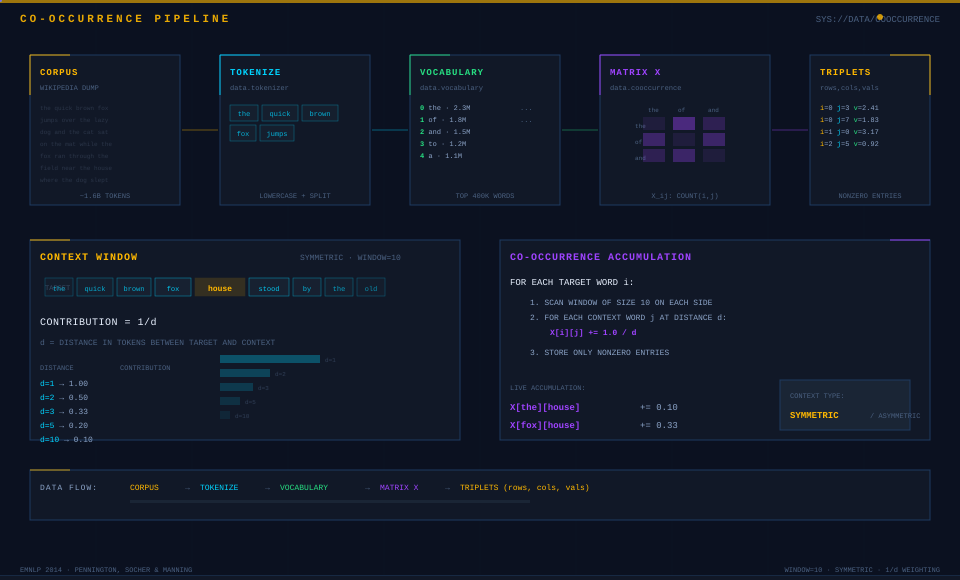
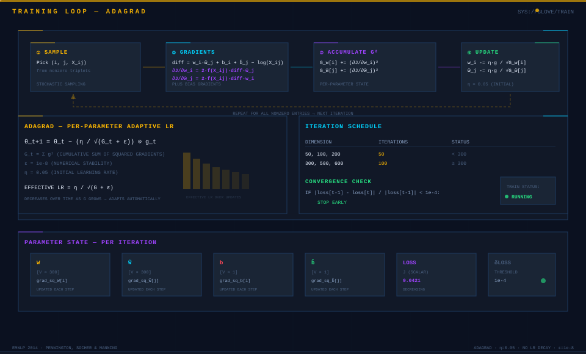
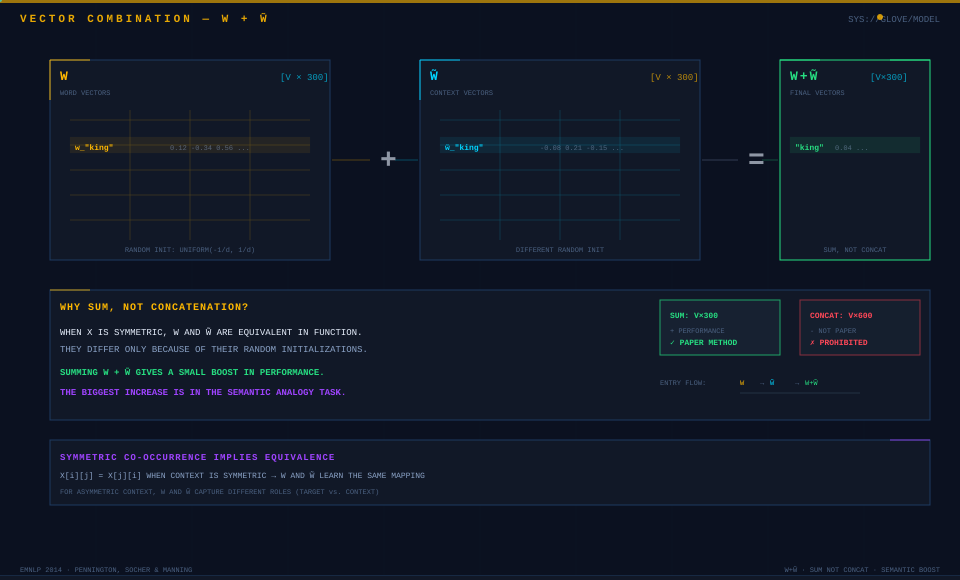
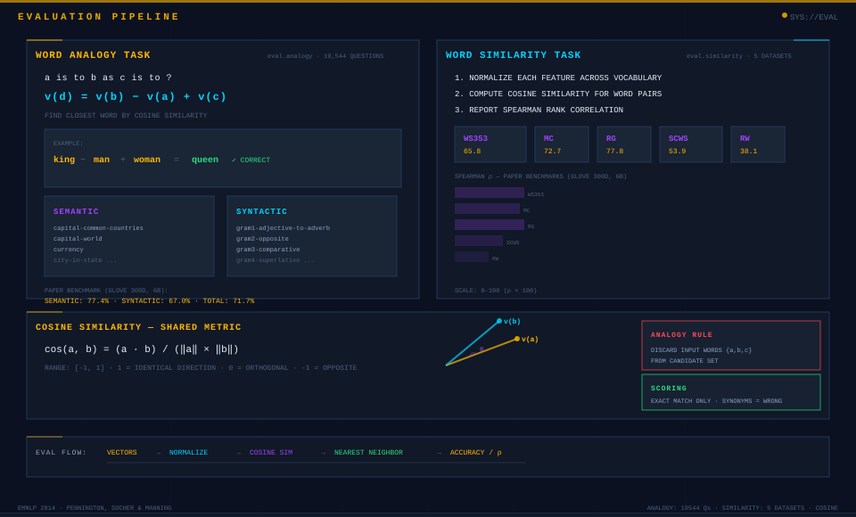

# GloVe: Global Vectors for Word Representation

from-scratch numpy implementation of GloVe (Pennington, Socher & Manning, EMNLP 2014). no pytorch, no tensorflow — just numpy, an adagrad optimizer, and the weighted least squares cost function from the paper.

## architecture


the model learns two sets of word vectors **W** and **W̃**, plus bias terms **b** and **b̃**. for each nonzero co-occurrence pair (i, j), compute the dot product `w_i^T · w̃_j`, add biases, and subtract `log(X_ij)`. the cost function J minimizes the squared difference, weighted by f(X_ij).

**final vectors = W + W̃** (sum, not concatenation). this gives a boost in semantic analogy accuracy.

## data pipeline



1. **tokenize** the corpus (lowercase, split on whitespace).
2. **build a vocabulary** of the top 400,000 words by frequency.
3. **construct the co-occurrence matrix X**. scan a symmetric window of 10 words on each side.
4. pairs at distance d contribute `1/d` to `X[i][j]`.
4. **extract triplets** (row indices, column indices, values) for all nonzero entries.

## cost function



the model minimizes a weighted least squares objective:

```
J = Σ f(X_ij) · (w_i^T · w̃_j + b_i + b̃_j − log(X_ij))²
```

the weighting function f(x) prevents rare co-occurrences from dominating and prevents frequent co-occurrences from overwhelming the loss:

```
f(x) = (x / x_max)^α   if x < x_max
f(x) = 1                 if x ≥ x_max
```

with `x_max = 100` and `α = 3/4`. the paper found that `α = 3/4` gives a modest improvement over `α = 1`.

## training



- **optimizer**: adagrad with per-parameter adaptive learning rates.
- **initial learning rate**: 0.05.
- **sampling**: stochastically sample nonzero entries from X each iteration.
- **iterations**: 50 for dimensions below 300; 100 for dimensions of 300 or more.
- **no learning rate decay**. adagrad adapts rates automatically.
- **convergence check**: if the relative change in loss falls below `1e-4`, stop early.

run training:

```
python -m glove.train --corpus data/corpus/wiki.txt --dim 300 --output outputs/vectors.txt
```

## vector combination



when the co-occurrence matrix is symmetric, W and W̃ are equivalent. they differ only because of their random initializations. summing them gives a small performance boost. the biggest increase is in the semantic analogy task.

## evaluation



### word analogy

19,544 questions divided into semantic and syntactic subsets. compute `v(d) = v(b) - v(a) + v(c)`, then find the closest word by cosine similarity. discard the input words. a question is correct only if the closest word is an exact match.

```
python -m eval.analogy --vectors outputs/vectors.txt --analogies data/analogies.txt
```

### word similarity

evaluate on five datasets: WS353, MC, RG, SCWS, RW. normalize each feature across the vocabulary. compute cosine similarity. report spearman rank correlation.

```
python -m eval.similarity --vectors outputs/vectors.txt
```

## results — paper benchmarks

glove 300d trained on 6 billion tokens:

| metric | score |
|--------|-------|
| semantic | 77.4% |
| syntactic | 67.0% |
| total | 71.7% |
| WS353 | 65.8 |
| MC | 72.7 |
| RG | 77.8 |
| SCWS | 53.9 |
| RW | 38.1 |

## baselines

five baselines from the paper:

| baseline | method |
|----------|--------|
| svd | truncated svd on the raw co-occurrence matrix |
| svd-s | truncated svd on sqrt(X) |
| svd-l | truncated svd on log(1+X) |
| word2vec skip-gram | 10 negative samples (gensim) |
| word2vec cbow | 10 negative samples (gensim) |

for svd baselines, the matrix is truncated to the top 10,000 most frequent context words before factorization.

run baselines:

```
python -m baseline.svd_baselines --corpus data/corpus/wiki.txt --dim 300
python -m baseline.word2vec --corpus data/corpus/wiki.txt --dim 300
```

## experiments

| experiment | what it does |
|------------|-------------|
| `experiment.dim_sweep` | train across dimensions [50, 100, 200, 300, 500, 600] |
| `experiment.context_sweep` | vary window size [2,4,6,8,10] × context type [symmetric, asymmetric] |
| `experiment.corpus_comparison` | compare glove, skip-gram, and cbow on the same corpus |
| `experiment.convergence` | track loss over iterations |

run experiments:

```
python -m experiment.runner --corpus data/corpus/wiki.txt --analogies data/analogies.txt
```

## project structure

```
├── config.py              # all hyperparameters (x_max, alpha, dim, lr, etc.)
├── data/
│   ├── download.py        # corpus download scripts
│   ├── tokenizer.py       # whitespace tokenizer
│   ├── vocabulary.py      # word frequency counting, top-n filtering
│   └── cooccurrence.py    # co-occurrence matrix with 1/d weighting
├── glove/
│   ├── model.py           # GloVeModel: cost, gradients, get_vectors
│   ├── weighting.py       # f(x) = (x/x_max)^alpha if x < x_max, else 1
│   ├── adagrad.py         # per-parameter adaptive learning rates
│   ├── train.py           # training loop with convergence check
│   └── io.py              # save/load word vectors
├── baseline/
│   ├── truncated_matrix.py # truncate co-occurrence to top 10k context words
│   ├── svd_baselines.py    # svd, svd-s, svd-l
│   └── word2vec.py         # skip-gram and cbow via gensim
├── eval/
│   ├── analogy.py         # 19,544-question analogy evaluation
│   ├── similarity.py       # WS353, MC, RG, SCWS, RW evaluation
│   └── metrics.py          # cosine similarity, spearman correlation
├── experiment/
│   ├── dim_sweep.py       # sweep across embedding dimensions
│   ├── context_sweep.py   # sweep across window sizes and context types
│   ├── corpus_comparison.py # compare methods on the same corpus
│   ├── convergence.py     # loss tracking over iterations
│   ├── comparison.py      # glove vs word2vec comparison runner
│   └── runner.py          # top-level experiment runner
├── viz/
│   ├── analogy.py         # analogy accuracy plots
│   ├── similarity.py       # similarity correlation plots
│   ├── tsne.py            # t-sne word vector projections
│   └── learning_curve.py  # training loss curves
├── tests/
│   ├── test_vocabulary.py
│   ├── test_cooccurrence.py
│   ├── test_weighting.py
│   ├── test_cost.py
│   ├── test_adagrad.py
│   ├── test_training.py
│   ├── test_baselines.py
│   ├── test_analogy.py
│   └── test_similarity.py
├── docs/
│   ├── usage.md
│   └── notes.md
└── outputs/
```

## reference

Pennington, J., Socher, R., & Manning, C. D. (2014). GloVe: Global Vectors for Word Representation. *EMNLP 2014*.
